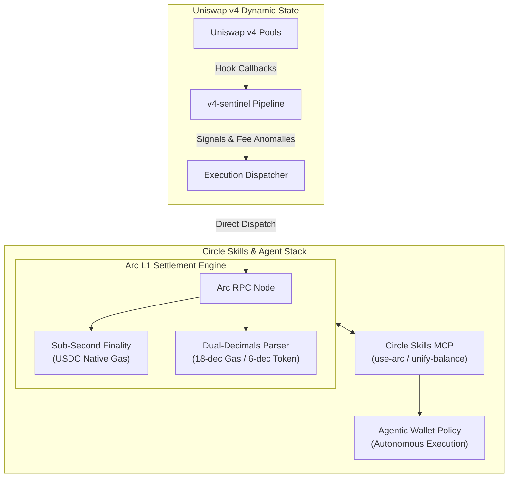

# V4-Sentinel: Event-Driven Liquidity Sentinel & Agentic Execution Engine

[](https://opensource.org/licenses/MIT)
[](https://docs.arc.network)
[](https://github.com/circlefin/skills)
[](#technology-stack)

An enterprise-grade, high-throughput onchain monitor and automated routing engine bridging **Uniswap v4 dynamic hook architectures** with the **Arc L1 economic operating system** and **Circle Agentic Commerce primitives**.

---

## 🏛️ System Architecture

`v4-sentinel` coordinates real-time dynamic fee signals, detects asymmetric liquidity shifts across Uniswap v4 pools, and dispatches automated, policy-bound execution workflows onto Arc L1 for deterministic, sub-second settlement denominated entirely in native stablecoin gas.



---

## ⚡ Key Capabilities

### 1. High-Throughput Hook Telemetry & Surveillance
* **Full Hook Lifecycle Tracing**: Asynchronous ingestion of `beforeSwap`, `afterSwap`, `beforeAddLiquidity`, and `afterRemoveLiquidity` hook events.
* **Microsecond State Serialization**: Powered by low-latency Go/Rust worker pools to prevent backpressure under extreme pool volatility.
* **Dynamic Fee & Imbalance Detection**: Real-time evaluation of fee deviations and cross-pool price divergence.

### 2. Arc Native Gas & Dual-Decimals Precision Abstraction Layer
* **18 vs 6 Decimals Protocol Engine**: Resolves Arc's underlying EVM execution model (18-decimal precision for RPC gas estimation and native base fees) against standard ERC-20 token layers (6-decimal precision for USDC/EURC contracts).
* **Deterministic Fee Budgeting**: Predictable, stablecoin-denominated execution costs with zero volatile gas token price volatility.

### 3. Circle Skills & Agentic Commerce (`circlefin/skills`)
* **Autonomous Agent Wallets**: Direct compatibility with `use-agent-wallet` and `agent-wallet-policy` for policy-bounded key management.
* **Unified Cross-Chain Liquidity Routing**: Programmatic integration of `unify-balance` and `bridge-stablecoin` (CCTP / Gateway) to rebalance collateral from Ethereum and Solana into Arc.
* **Automated x402 Micropayments**: Built-in support for agent-to-agent autonomous service settlement.

---

## 📁 Repository Structure

```tree
v4-sentinel/
├── adapters/                 # Blockchain RPC & Provider Connectors
│   ├── arc/                 # Arc L1 Client & Dual-Decimals Gas Engine
│   └── uniswap_v4/          # V4 PoolManager & Hook Event Listeners
├── agents/                  # Autonomous Execution & Policy Modules
│   ├── policies/            # Agent Wallet Spend & Slippage Guardrails
│   └── skills/              # Circle Skills Integration Wrapper
├── cmd/                     # CLI Binaries and Daemons
│   └── sentinel/            # Main Sentinel Event Daemon Entrypoint
├── configs/                 # Network & Contract Configuration
├── core/                    # Low-Latency Math & Telemetry Parsers (Rust)
├── scripts/                 # Deployment, Benchmarking & Tooling
├── Makefile                 # Build & Test Targets
├── README.md
└── config.example.yaml      # Configuration Template
```

---

## 🛠️ Technology Stack

| Layer | Component | Description |
| :--- | :--- | :--- |
| **Execution Core** | Rust / Go | Low-latency state math, high-concurrency event ingestion, memory safety |
| **Quantitative Pipelines**| Python 3.11+ | Signal aggregation, fee anomaly models, simulation harnesses |
| **Settlement Layer** | Arc Public Testnet | EVM-compatible L1, Native USDC Gas, sub-second finality |
| **Agent Primitives** | Circle Skills & MCP | Developer-Controlled Wallets, CCTP, Account Abstraction |

---

## 🚀 Quick Start

### 1. Prerequisites
* Go `1.22+` / Rust `1.78+` / Python `3.11+`
* Access to an Arc Public Testnet RPC endpoint
* Circle Developer Console API Key & Entity Secret (for programmatic wallet management)

### 2. Environment Setup
Clone the repository and copy the sample configuration:
```bash
git clone https://github.com/aa160999/v4-sentinel.git
cd v4-sentinel
cp config.example.yaml config.yaml
```

Edit `config.yaml` to specify your network credentials:
```yaml
arc:
  rpc_url: "https://testnet.arc.network"
  chain_id: 50420
  gas_token_decimals: 18
  usdc_contract: "0x..."

circle:
  api_key: "${CIRCLE_API_KEY}"
  entity_secret: "${CIRCLE_ENTITY_SECRET}"
  wallet_id: "${CIRCLE_AGENT_WALLET_ID}"

uniswap_v4:
  pool_manager: "0x..."
  monitored_hooks:
    - "0x..."
```

### 3. Build & Run
```bash
# Compile core binaries
make build

# Start the Sentinel daemon in active surveillance mode
./bin/v4-sentinel --config config.yaml --mode=active-listener
```

---

## 🗺️ Roadmap & Milestones

- [x] **v0.1**: Initial Uniswap v4 hook event telemetry and parser.
- [x] **v0.2**: Arc Public Testnet integration & dual-decimals gas calculator.
- [ ] **v0.3**: Native `circlefin/skills` runtime bridge (`use-arc`, `unify-balance`, `agent-wallet-policy`).
- [ ] **v0.4**: Sub-second deterministic settlement routing pipeline for autonomous agents.
- [ ] **v1.0**: Mainnet release aligned with Arc L1 deployment.

---

## ⚖️ License & Disclaimer

This project is licensed under the [MIT License](LICENSE).

*Disclaimer: This codebase is experimental software designed for research into decentralized liquidity coordination and agent-driven commerce. Verify all operational parameters and security policies before deploying capital.*
